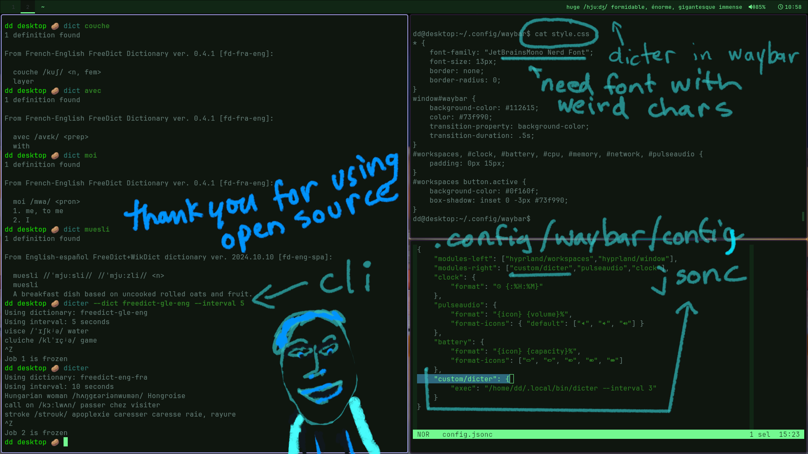
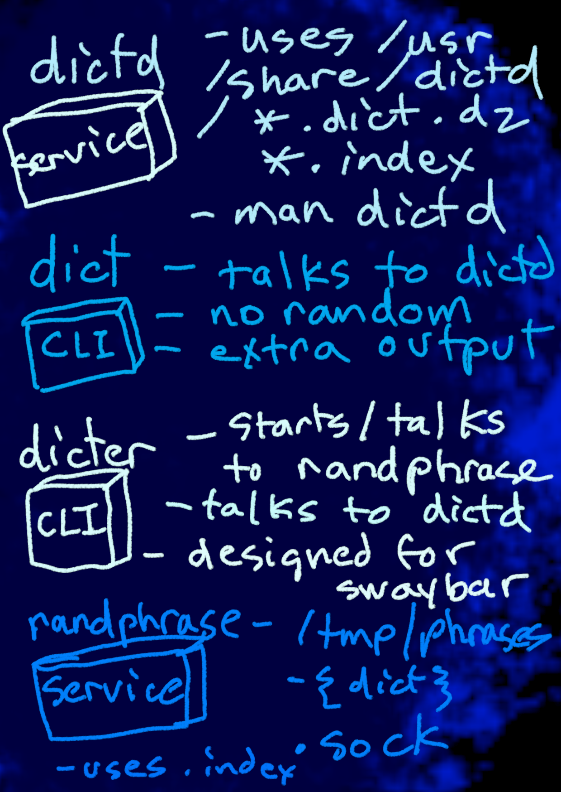

# dicter - the dictd ticker

Darrell Dupas - March 06, 2026, renedupas@proton.me

_display random translations as a learning tool_



[dicter demo](dicter-demo.mp4)

## dict short coming

When I pick up a real dictionary my urge is to find a random word.

Dicter looks up random definitions from one of the freedict dictionaries you've
installed. The default is English to French translation.

> [!NOTE]
> dicter is designed to be used as a swaybar status_line
> or a custom waybar plugin, but can be used in the terminal

## dictd required

For dicter to work you must have the dictd service running. You also need
to have whatever dictionaries installed. So, if you want the default, install
freedict-eng-fr.

## Split architecture

The random phrase generator will always have all its phrases in memory and
dicter is a client to randphrase. Multiple dicter instances will share the
randphrase socket server. The biggest annoyance about splitting the 2 parts is
that they should be in PATH. Really probably unnecessary to split, but once it
was done I just left it. This is only a learning project after all.




## How to install the freedict dictionaries

```
 systemctl start dictd
 sudo apt install dict-freedict-fra-eng
 dicter --dict freedict-fra-eng
```

## How to netcat dictd

You can learn a lot more about dictd elsewhere, but a fun way to see if anyone is
home is nc port 2628.

```
nc localhost 2628

HELP
```

## How to install as status_command in swaybar

~/.config/sway/config file you would use:

```
bar {
  status_command dicter
}
```
> [!NOTE]
> Troubleshoot running swaybar from a terminal with -d

> [!TIP]
> Troubleshoot dictd with dict first

## How to install dicter as a custom module in waybar

Use a custom module in your .config/waybar/config.jsonc

```jsonc
{
    "modules-left": ["hyprland/workspaces","hyprland/window"],
    "modules-right": ["custom/dicter","pulseaudio","clock"],
    "clock": {
        "format": " {:%H:%M}"
    },
    "pulseaudio": {
        "format": "{icon} {volume}%",
        "format-icons": { "default": ["", "", ""] }
    },
    "battery": {
        "format": "{icon} {capacity}%",
        "format-icons": ["", "", "", "", ""]
    },
    "custom/dicter": {
        "exec": "/home/dd/.local/bin/dicter --interval 3"
    }
}
```
> [!WARNING]
> Do not use the interval parameter in waybar, use the interval parameter
> to dicter instead. dicter does not want to be rerun over and over

## How to run with interval

```
dicter --interval 1
```
  
## How to run with some other dictionary

```
apt search dict-freedict
apt install dict-freedict-gle-eng dict-freedict-eng-gle
dicter --dict freedict-gle-eng
```

## dicter flags

- **`--dict <name>`**: Freedict dictionary name (example: `freedict-fra-eng`).
- **`--interval <secs>`**: Seconds between updates (default `10`).
- **`--pronounce`**: Keep `/.../` pronunciation segments in output (default is **off**; when off, dicter replaces `/.../` with `-`).

## how to limit the width of dicter with scroller

There is an additional program in this workspace called scroller which you can
use to limit the width, the parameters are --duration_ms, which should match
the interval of dicter, dicter's interval is how often a word changes, and
srollers duration is how often it looks for new things to scroll, so they should
match on the pipeline. scrollers' --interval_ms is how often the letters move.

```
dicter --interval 10 | scroller --duration_ms 10000 --width 30 --interval_ms 250
```

Also, keep in mind that waybar uses sh, *NOT BASH*, to exec, therefore, 
setting your path in .bashrc will not help you in your waybar config, hence, 
I just use full paths in config.json like so:

```
    "custom/dicter": {
        "exec": "/home/dd/.local/bin/dicter --interval 10 | /home/dd/.local/bin/scroller --interval_ms 100 --duration_ms 10000 --width 30",
    }
```

## scroller --chop 5

There is an additional, optional parameter called chop, default value 5. When 
the line is less than width + chop, instead of scrolling that little bit,
we just truncate to `width` and do not scroll.

## scroller flags

- **`--width <cols>`**: Output width in terminal columns (required).

- **`--duration_ms <millis>`**: Total time to animate each incoming line
(required except for reader mode); usually matches dicter `--interval`).

- **`--interval_ms <ms>`**: Time between animation frames in milliseconds
(required).

- **`--chop <n>`**: If a line is only slightly longer than `--width` (≤ `width +
chop`), truncate instead of scrolling (default `5`).

- **`--lpad <str>`** : string to prepend to the scroll region

- **`--rpad <str>`** : string to append to the scroll region
 
- **`--nopad <str>`** : no padding 

- **`--start-delay <secs>`**: Delay before starting scroll motion (only when
scrolling) (default `2`).

- **`--switch-delay <ms>`**: Pause when scroll direction changes or wraps around
(default `0`).

- **`--mode <mode>`**: Scroll mode. Available modes: `dicter-default`,
`inner-bounce`, `marquee`, `reader`. Default: `dicter-default`.

- **`--x <col>`**: Horizontal position within terminal window.

- **`--y <row>`**: Vertical position within terminal window.

> [!NOTE]
> x and y only make sense if you are running on the command line not as a
> bar plugin. --y 1 --x 1 is top left. By default, we run in debug/plugin
> mode, so x and y are not set normally, see scroll_mode_tester.nu for
> a visual of normal output for debug/plugin

## Scroller Modes

- **`dicter-default`**:  when narrower sit still right aligned. When wider start
  left aligned and scroll to the left until the right-most letter hits the right
  edge, then change directions and go back to the start


- **`inner-bounce`**:  The left edge of the text hits the inner-left edge and
  stops; the right edge of the text hits the inner-right edge and stops; then it
  reverses direction. (this is the same as dicter-default unless the text is
  less than width, inner-bounce will have short text scrolling back and forth)


- **`marquee`**: Text starts fully off-screen to the right (window initially
  blank), flows in from the right edge, scrolls across to the left, flows out
  past the left edge, then repeats. Each cycle starts with a blank window. A
  test is available in `tester.nu` with 20 cycles.

- **`reader`**: Reader mode is designed to read an entire document inside a
  scroller window, with no breaks between lines, that is, scroller rolls over
  the entire text file seamlessly. There is no duration parameter with
  reader mode, it is calculated by width and interval.

Project Notes
=============

- Tasks Menu available by running:
```
nu tasks.nu
```
- Testing of scroll modes incomplete, see scroll_mode_tester.nu
- You can interrupt with sigint (ctrl-c) or sigquit (ctrl-\\)
- No tests on pipe overflow or anything like that
- LLM Disclosure. LLM's were used on parts of this project, but not all.
- All LLM code has been reviewed.
- There is another repo in my Github to modify Dictd so that it runs on Alpine
  Linux, <https://github.com/dirtslayer/dictd>, use the musl-tcp branch.
- The packages required to compile Dictd on Alpine are:
```
build-base mk-configure mk-configure-dev libmaa-dev zlib-dev musl-dev
```
### Learning Project Wrap

What happened to the git history? Yes I torched it. I went fully experimental
with JJ and kept having merge conflicts, and here is the craziest part: I let
an LLM do some housekeeping and kaboom! I also got frustrated with all the
pr's.  Since I like to have main up to date, it resulted in having JJ make for
way too many pull requests. Also, I didn't enjoy how JJ creates pr body's all
kept combining.

I suppose I didn't clean up after myself in someway, but, no matter how novel
something is, if it is new it can break your flow state, and so, I'll admit, it
was a moment of frustration I torched my .git and .jj folders. Also, I did not
want the nightmare commit history of learning jj here to reflect on.

The biggest thing I've learned here, besides being thankful that I learned
Nushell, is that LLM's are hard to use still. Often I would get something
working and then down the line it would break. As such, you need tests, LLM's
without tests is crazy!

The nu-unit-test, tasks.nu, and scroll_mode_tester.nu are what is best about
this entire repo because it is a structured framework that helped smooth out
the entire cycle of plan, build, test.

This project was conceived, coded and finished in the span of about 1 week, in
the middle of March, in Redwater, Alberta. It is a beginner project but has
many moving parts that show many aspects of software development. Feel free to
comment as an issue or reach out to me if you see something I missed. Which is
entirely possible as I am in a rush to get this off my plate and go into rehab.

Thank you for using open source, have a nice day.
